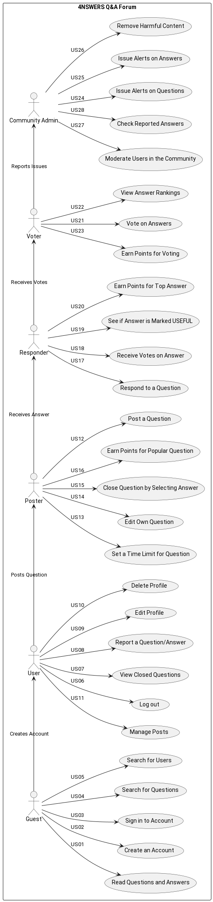

# ER: Requirements Specification Component

 Our project aims to redefine what it means to be online and have questions. Our goal is to ensure that every user feels comfortable asking questions and confident that they will receive fast and constructive answers in a friendly environment. We will have a rating system to ensure only the best and most helpful answers according to the community get to the top.
 

## A1: 4NSWERS

 As Learners, we often have questions that need answers as fast as possible. So we decided to create a Collaborative Q&A Content Rated Forum Website adapted for those situations.
 
 In this website, the user can post their questions or doubts about a certain topic, and other users can respond with what they think it is the best answer to the current problem.

 As those various answers start stacking up in the post's feed, they are positively or negatively voted by all the users, affecting the answers' order of appearance in the feed (meaning the most publicly supported answers appear first).

 The website contains a points system (gamification).
 The users that have the top 4 best answers in a certain feed acording to the votes, and the user that has had its answer marked as USEFUL by the poster, receive reward points. The poster also receives a certain amount of points depending on how popular the question's feed was.

 The top 16 users with the most points are shown in a special hall of fame ranking in the website.

 Users can make comments on other peoples' answers.
 
 Knowing that the website encourages a fast answer delivery mentality, all the questions' feeds are open only during a predetermined amount of time up to 48 hours maximum, selected by the poster.
 
 The question's feed closes when time runs up, or when the poster declares one of the answers as USEFULL.
 
 After its closure, the post's feed will remain up for users to read it, despite users now being blocked from posting new answers and voting on existing ones.

 During the entirety of this process, an Admin may appear and provide an analysis of the answer(s), alerting the community for the existence of an incorrect answer with alerts, independently if the original poster declared that answer as USEFUL or not.
 The probability of a post receving an Admins analysis is higher on posts that are having more user interactions (trending), or when a significant amount of users have reported a certain answer or feed.
 Users that have had their answers flagged by an Admin's Alert, may lose a certain amount of points, that amount depending on the type of the Alert. The same applies to posters with flagged questions.

The central motivation behind this project is to find a way to reduce the frustration of not having someone to ask about an important and/or urgent question or doubt. Our project helps by having multiple users engaged to answer our questions the best way they can.

## A2: Actors and User stories

The goal for this artifact is to define how users will interact with our website. It also serves as a guideline for features.

### 1. Actors

**Table of Actors**

| **Actor**       | **Description**                                                                                     |
|-----------------|-----------------------------------------------------------------------------------------------------|
| Guest           | A non-authenticated user that can read questions and answers.   |
| User | Any individual that can post questions, answer questions, vote, and comment on answers.              |
| Poster          | A user who posts a question and selects a timeframe during which answers can be submitted, and can eventually declare one of them USEFUL.           |
| Responder       | A user who answers questions and contributes to discussions by commenting on other answers.                |
| Voter           | A user who votes on the validity or quality of answers to help promote the best ones.                |
| Community Admin           | A moderator responsible for flagging harmful or incorrect answers (ALERTS) and moderating users in its community.  |

### 2. User Stories

### 2.1 Actor 1: Guest

| **ID**   | **Name**                     | **Priority** | **Description**                                                                                                                |
|---------|------------------------------|--------------|-------------------------------------------------------------------------------------------------------------------------------|
| US01     | Read a Question and respective Answers               | High         | As a Guest, I want to read questions so that I can get answers to my doubts without having to create an account.          |
| US02     |  Create an account         | High        | As a Guest, I want to be able to create an account so I can log in.
| US03     |  Sign in    | High        | As a Guest, I want to be able to sign in to my account so I can be identified.
| US04  |   Search for Questions    | Medium | As a Guest, I want to search for questions similar to mine that have already been answered so I can find other answers to similar problems. |
| US05  |   Search for Users    | Medium | As a Guest, I want to search for other users so I can check their profile. |

#### 2.2. Actor 2: User

| **ID**   | **Name**                     | **Priority** | **Description**                                                                                                                |
|---------|------------------------------|--------------|-------------------------------------------------------------------------------------------------------------------------------|
| US06     |  Log out     | High        | As a User, I want to be able to log out so other people using the device don't use my account.
| US07     |  View Closed Questions     | Medium      | As a User, I want to be able to view closed question feeds so I can learn from past discussions.
| US08     |  Report a Question/Answer  | Medium      | As a User, I want to be able to report Question/Answer that seem harmful or misjudged so that admin can review the Question/Answer.           |
| US09     |  Edit Profile  | Medium      | As a User, I want to be able to edit my profile so I can change my information. |  
| US10     |  Delete Profile  | Medium      | As a User, I want to be able to delete my profile so I don't have an account anymore. |  
| US11     |  Manage Posts  | Medium      | As a User, I want to be able to edit and delete my old posts, answers and comments, so they are not public anymore. |               

#### 2.2 Actor 3: Poster

| **ID**   | **Name**                     | **Priority** | **Description**                                                                                                                |
|---------|------------------------------|--------------|-------------------------------------------------------------------------------------------------------------------------------|
| US12     | Post a Question               | High         | As a Poster, I want to post a question so that others can provide answers to my query.  |
| US13     | Set a Time Limit for Question | High         | As a Poster, I want to set a time limit for how long answers can be submitted to my question so the question closed when not needed anymore.                                  |
| US14   | Edit its own Question | Medium   | As a Poster, I want to be able to edit my question after having already posted it so that I can fix my question.  |
| US15     | Close Question by Selecting Answer | Medium   | As a Poster, I want to close my question when I have received a satisfactory answer so no one else can answer.  |
| US16     | Earn points | Medium   | As a Poster, I want to earn some points if my question is popular so I go up in the rankings.          |

#### 2.3. Actor 4: Responder

| **ID**   | **Name**                    | **Priority** | **Description**                                                                                                                   |
|---------|-----------------------------|--------------|-----------------------------------------------------------------------------------------------------------------------------------|
| US17     | Respond to Question          | High         | As a Responder, I want to be able to answer to questions that interest me so I can give my input.             |
| US18    | Receive Votes on my Answer   | High         | As a Responder, I want users to vote on my answer to determine its relevance and correctness so that I can learn if my solution is good or not.             |
| US19     | See if Answer is Marked USEFUL | High       | As a Responder, I want to see if my answer has been marked USEFUL by the poster, so I know if I have successfully helped the poster.   |
| US20     | Earning points |  Medium      | As a Responder, I want to earn points if I'm one the top 4 best answers and/or if the poster marks my answer as USEFUL so that I can increase my chances of being in the top 16 hall of fame.   |

#### 2.4. Actor 5: Voter

| **ID**   | **Name**                    | **Priority** | **Description**                                                                                                                  |
|---------|-----------------------------|--------------|----------------------------------------------------------------------------------------------------------------------------------|
| US21    | Vote on Answers              | High         | As a Voter, I want to positively or negatively vote on answers based on how helpful and accurate I think it is to the problem, so that I can help the Poster obtain a satisfactory answer.             |
| US22    | View Answer Rankings         | Medium       | As a Voter, I want to see how answers rank based on community votes so that I can check the most popular answers.                  |
| US23     | Earning points |  Low      | As a Voter, I want to earn some points for voting so that my time reading other people's posts is also rewarded points wise.  

#### 2.5. Actor 6: Community Admin

| **ID**   | **Name**                    | **Priority** | **Description**                                                                                                                  |
|---------|-----------------------------|--------------|----------------------------------------------------------------------------------------------------------------------------------|
| US24    | Issue Alerts on questions          | High         | As an Admin, I want to issue an alert when an question is found to be inappropriate or irrelevant to the community it was posted in, so that I can give users an experience that is aligned with their expectations.     |
| US25    | Issue Alerts on answers          | High         | As an Admin, I want to issue an alert when an answer is found to be incorrect, even if it is marked USEFUL, so that I can inform future readers that the answer might not be correct.       |
| US26    | Remove Harmful Content       | High         | As an Admin, I want the ability to delete harmful or misleading content so that I can maintain the integrity of the platform.                |
| US27    | Moderate users in the community       | High         | As an Admin, I want the ability to moderate users in the community, having the ability to alert, and if necessary, to temporarilly or permanently ban them so that I keep my community clean.                |
| US28    | Check reported answers   | Medium       | As an Admin, I want to be able to analyse questions and answers that have been reported so that I can keep my community clean.    |

### 3. Supplementary Requirements

#### 3.1. Business Rules

| **ID**   | **Name**                            | **Description**                                                                                                                      |
|---------|-------------------------------------|--------------------------------------------------------------------------------------------------------------------------------------|
| BR1     | Voting Integrity                    | Users can only vote once per answer. A vote may be changed, but not duplicated.                                                 |
| BR2     | Post Closure Policy                 | Questions will close either when the selected time expires or when the poster marks an answer as USEFUL, whichever occurs first.       |
| BR3     | Reporting Answers           | Users can report an answer they think is harmful or incorrect. After reaching a threshold of reports, the system alerts Admin for review.                     |
| BR4     | User can not auto-answer           | Users can not answer to their own posts, but can comment on other users' answers to their questions. |
| BR5     | Deleted User Contents           | Questions, answers and comments remain even after the user's account elimination, appearing as posted by an deleted account.
| BR6     | Time Paradox Forbidden           | Users can not answer a question THAT STILL HASN'T BEEN POSTED, AS IT IS IMPOSSIBLE ACCORDING TO OUR CURRENT UNDERSTANDING OF THE LAWS OF TIME AND SPACE.     |

#### 3.2. Technical Requirements

| **ID**   | **Name**                          | **Description**                                                                                                                      |
|---------|-----------------------------------|--------------------------------------------------------------------------------------------------------------------------------------|
| **TR1**     | **Responsive Design**                | **The platform must be accessible on desktop devices.**  **Because we want the users to be able to use this regardless of the size of their screen**      |
| **TR2**     | **Notification System**               | **Users must receive notifications when someone responds to their question, comments on their answer, or issues an alert.** **Because we want the users to be informed as soon as possible.** |       
| **TR3**     | **Accessibility**        | **The platform must be accessible to everyone that follows the terms and conditions.** **Because we want to receive anyone that promotes a healthy environment in our platform.** |

#### 3.3. Restrictions

| **ID**   | **Name**                          | **Description**                                                                                                                       |
|---------|-----------------------------------|---------------------------------------------------------------------------------------------------------------------------------------|
| R1      | Anonymous Posting Not Allowed     | Users must be registered and logged in to post questions or answers.                                                                  |
| R2      | Maximum Time Limit for Questions  | A question can remain open for a maximum of 48 hours before it automatically closes.                                                   |
| R3      | Admin Alert Response Time   | Admins must review reported content within 24 hours to ensure swift removal of harmful content or alert activation.                                        |

